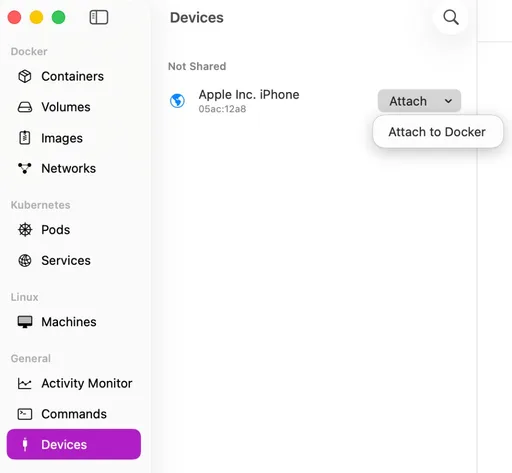

# iorb-revtether
Share macOS internet with iOS using OrbStack

POC: share Mac internet with an iPhone over USB using OrbStack + Docker (L3 NAT, not a proxy).

```
iPhone ──USB──► OrbStack Linux (cdc_ncm / usb0)
                      │
                 dnsmasq + iptables NAT
                      │
                 Mac uplink (Wi‑Fi / Ethernet)
```

## Requirements

- [OrbStack](https://orbstack.dev/) with [USB passthrough](https://docs.orbstack.dev/features/usb)
- Docker
- iPhone, USB cable, **Trust** this computer
- macOS **Internet Sharing** off (avoid fighting the container for the USB link)

## Attach iPhone to OrbStack

The iPhone must be passed through to OrbStack Linux before starting the container. While attached, macOS loses the USB
device until you detach it. See [OrbStack USB devices](https://docs.orbstack.dev/features/usb) for details.

### GUI (Devices tab)

1. Plug in the iPhone and tap **Trust**
2. Open OrbStack → **Devices**
3. Under **Not shared**, select **Apple Inc. iPhone** (`05ac:12a8`)
4. Click **Attach** → **Attach to Docker**



### CLI

```bash
orb usb list
orb usb attach <id>    # ID from first column; device leaves macOS until detach
orb usb detach <id>    # return device to macOS
```

Attached devices are available to containers via `/dev/bus/usb`.

## Quick start

Image: `ghcr.io/trung-dv/iorb-revtether:latest` ([GHCR](https://github.com/Trung-DV/iorb-revtether/pkgs/container/iorb-revtether))

```bash
# 1. Attach iPhone (GUI or CLI above)

# 2. Start router
docker run -d \
  --name ios-shared \
  --privileged \
  --network host \
  --restart unless-stopped \
  -v /dev/bus/usb:/dev/bus/usb \
  ghcr.io/trung-dv/iorb-revtether:latest

# 3. On iPhone: Wi‑Fi and cellular OFF, replug USB once after "Router ready"
docker logs -f ios-shared
```

Stop and remove:

```bash
docker rm -f ios-shared
```

## How it works

1. **`usb_setup.py`** — USB mode 3, config 5 (CDC-NCM reverse tether), release device for kernel `cdc_ncm`
2. **Kernel** — creates `usb0` (needs `network_mode: host`)
3. **`entrypoint.sh`** — DHCP (`172.20.10.2–14`), NAT to default uplink, DNS redirect to `172.20.10.1`, UDP checksum fix

Phone gateway/DNS: `172.20.10.1`

## Debug / verbose logs

Default is quiet. Pass `VERBOSE=1` when starting the container:

```bash
docker run -d \
  --name ios-shared \
  --privileged \
  --network host \
  --restart unless-stopped \
  -v /dev/bus/usb:/dev/bus/usb \
  -e VERBOSE=1 \
  ghcr.io/trung-dv/iorb-revtether:latest

docker logs -f ios-shared
```

With `VERBOSE=1` you get `[usb-setup]`, `[dnsmasq]` (DHCP/DNS), `[net]` stats every 30s, and `[pcap]` on the phone
interface.

## Troubleshooting

| Symptom                | Fix                                                                                    |
|------------------------|----------------------------------------------------------------------------------------|
| `no iPhone`            | Plug in, Trust, attach in OrbStack Devices or `orb usb attach` **before** `docker run` |
| `no cdc_ncm interface` | Re-attach USB; replug cable; wait for `Router ready`                                   |
| iPhone has no internet | Wi‑Fi/cellular off; replug USB; check `docker logs` for DHCP                           |
| USB setup errors       | `orb usb detach` then attach again; macOS Internet Sharing off                         |

Test from iPhone: open `http://neverssl.com`

## References

- [OrbStack — USB devices](https://docs.orbstack.dev/features/usb)

## Layout

| File                           | Purpose                                             |
|--------------------------------|-----------------------------------------------------|
| `compose.yml`                  | Container config (`network_mode: host`, USB volume) |
| `entrypoint.sh`                | Router: NAT, DNS, dnsmasq                           |
| `usb_setup.py`                 | USB config 5 + kernel handoff                       |
| `docs/orbstack-usb-attach.png` | Screenshot: Attach iPhone in OrbStack               |
